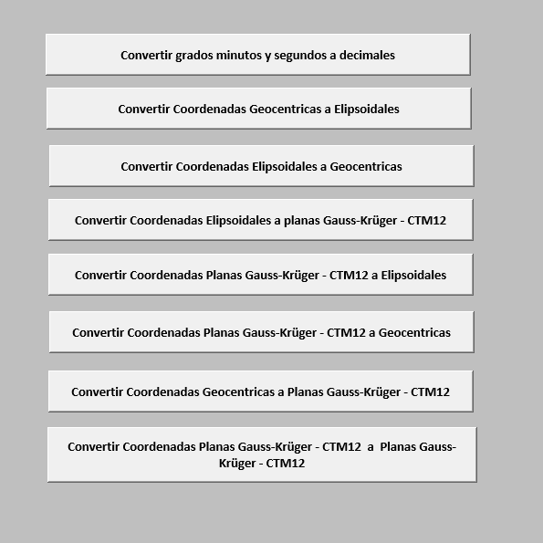
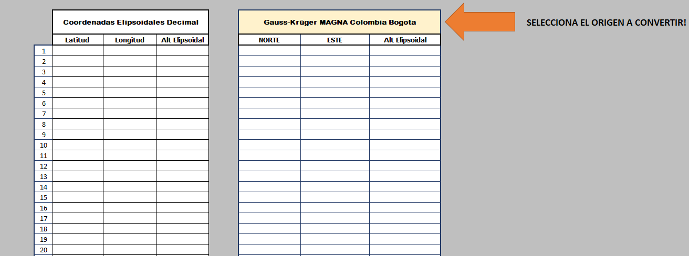
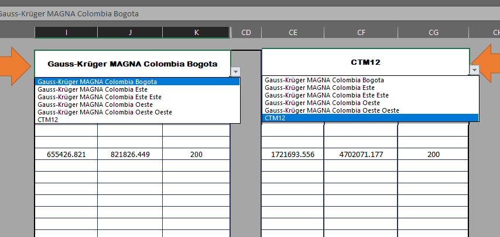

# EL PAGO SE ESTA PROCESANDO....

El archivo se descargara en un .zip, toca descomprimir y encontraras el Libro de Excel...

# Libro de Excel para Transformación de Coordenadas Colombianas

## Descripción

Este libro de Excel está diseñado para facilitar la conversión de coordenadas para diferentes sistemas usados en Colombia. Contiene funciones que permiten transformar coordenadas de:

- Grados, minutos y segundos a decimales
- Coordenadas Geocéntricas a Elipsoidales
- Coordenadas Elipsoidales a Geocéntricas
- Coordenadas Elipsoidales a planas Gauss-Krüger - CTM12
- Coordenadas planas Gauss-Krüger - CTM12 a Elipsoidales
- Coordenadas planas Gauss-Krüger - CTM12 a Geocéntricas
- Coordenadas Geocéntricas a planas Gauss-Krüger - CTM12
- Coordenadas planas Gauss-Krüger - CTM12 a Gauss-Krüger - CTM12

## Instrucciones de Uso

Para usar este libro, siga los pasos a continuación:

1. Abra el libro de Excel.
2. Navegue a través de las diferentes hojas que corresponden a cada tipo de transformación de coordenadas.
3. Ingrese sus datos en las celdas designadas.
4. Observe los resultados convertidos en las celdas de salida correspondientes.

Nota: Las hojas incluyen botones que facilitan la navegación y el ingreso de datos.

## Requerimientos

Para utilizar este libro es necesario tener una versión de Microsoft Excel que soporte macros, ya que el libro utiliza VBA para realizar las conversiones.

Activar el modo macro para que se pueda ejecutar

## forma de adquisición

Puedes comprar el libro por el siguiente boton de Mercado Pago: 

- [Comprar](URL_A_UNA_GUIA)

- [Comprar](URL_A_UNA_GUIA)
